# DV-Tree — Architecture and Concurrency Discussion

> [!abstract] One-sentence idea
> DV-Tree uses an adapted TUM B+ tree only for ordered LHS lookup; one native
> pointer per leaf record points to stable, out-of-page dependency metadata, while
> CID-ordered key/interval reservations permit disjoint installation, and a
> cumulative change-point history maintains an exact dependency verdict for
> every retained snapshot without an additional Hyrise publisher hook.

## Table of contents

- [1. Current design at a glance](#1-current-design-at-a-glance)
  - [Data ownership and storage](#exact-data-ownership-and-storage-locations)
- [2. Structural B+ tree and OLC](#2-structural-b-tree-and-olc)
  - [Page layout](#fixed-size-slotted-page)
  - [OLC lookup and update](#olc-lookup-and-update)
  - [Exact structural latching](#exactly-which-part-of-the-tree-is-latched)
- [3. Storage and dependency metadata](#3-storage-model-and-dependency-metadata)
- [4. Key normalization](#4-key-normalization)
- [5. Snapshot isolation, MVCC, and concurrency](#5-snapshot-isolation-mvcc-and-concurrency)
  - [Snapshot history](#snapshot-history-capacity-and-exact-answers)
  - [Commit lifecycle](#commit-lifecycle)
  - [Footprint overlap calculation](#how-overlap-is-calculated-after-cid-reservation)
  - [Concurrency examples](#publisher-free-overlapping-arrival-t2-reaches-x-first)
- [6. Hyrise integration](#6-hyrise-integration-target-and-reviewed-path-comparison)
- [7. Provenance and ownership](#7-provenance-what-came-from-where)
- [8. Implementation TODOs](#8-implementation-todos)
- [9. Open discussion questions](#9-open-discussion-questions)
- [10. References](#10-references)
- [Appendix A. Legacy designs and APIs](#appendix-a-legacy-designs-and-apis)

## 1. Current design at a glance

> [!decision] Current design decisions — publisher-free integration target
> - **No additional Hyrise pre-visibility publisher hook.** DV-Tree work finishes
>   before the existing `CommitContext` becomes pending; Hyrise's existing
>   consecutive CID advancement remains the final visibility boundary.
> - **Register before proceeding.** The complete normalized dependency footprint
>   is registered atomically with CID assignment. FD registers affected LHS
>   entries; OD registers the affected entries plus conservative neighbour/
>   topology intervals. A higher CID may never proceed while a lower CID exists
>   but has not registered its footprint.
> - **Order only actual conflicts.** Registered footprints form logical
>   CID-ordered reservations; the current implementation compares them in the
>   per-tree registry rather than allocating a physical queue per key. A
>   transaction privately prepares non-conflicting entries immediately and
>   parks on lower-CID intersections. It waits for an explicit predecessor-
>   completed/aborted state—not for `version == CID - 1`—then reads and validates
>   the current entry/topology version.
> - **Never wait while latched.** B+ tree node latches and `DependencyEntry`
>   mutexes remain short-lived. Commit waits use a condition variable or atomic
>   wait; continuous spinning and waiting while holding a page/entry latch are
>   excluded.
> - **Install one transaction batch internally.** Prepared changes remain private
>   until every affected resource is ready. Memory is preallocated first; the
>   standalone's complete multi-entry installation is non-failing. Hyrise must
>   extend this to a transaction-atomic multi-tree batch. Only afterwards are
>   reservations released and the Hyrise `CommitContext` allowed to become
>   pending. Same-physical-row write conflicts remain Hyrise row-MVCC
>   responsibility.
> - **Two-level verdict history.** Out-of-order completed transactions first enter
>   a per-tree ordered pending map. Ready affected CIDs drain in order into a
>   retained change-point history. The retained record stores `{CID,
>   total_after}` (and may retain `delta` for auditing), so an exact snapshot
>   query binary-searches the last change at or before `S` instead of summing the
>   history on every request. Zero-change CIDs need no retained record.
> - **Snapshot retention follows SI, not every historical CID.** DV-Tree keeps one
>   baseline total plus every change point required by the oldest active Hyrise
>   snapshot. The default capacity is a soft target: history grows beyond it
>   rather than overwriting an active snapshot, then folds eligible visible
>   entries when the horizon advances. Arbitrary expired-CID time travel is a
>   separate DBMS-wide feature requiring retained Hyrise row versions as well.
>
> The standalone project models this protocol and its correctness boundaries.
> Collecting the transaction footprint and marking the existing Hyrise
> `CommitContext` pending remain integration work performed later in Hyrise.

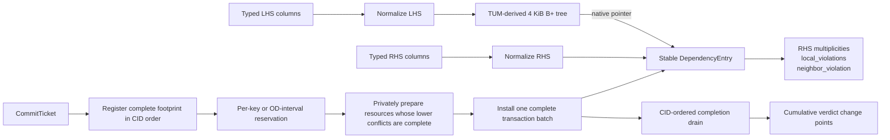

What this diagram shows:

- **Data routing:** LHS and RHS columns are normalized separately; only the LHS
  enters the B+ tree.
- **B+ tree:** finds the stable metadata object for a normalized determinant.
- **DV layer:** maintains normalized RHS multiplicities, the configured FD or
  OD violation score, transaction preparation, snapshot history, and commit
  ordering.
- **Concurrency:** only transactions whose registered footprints intersect wait
  for each other; disjoint higher CIDs may install before a lower CID completes.
- **History:** stores cumulative aggregate-score change points, not historical
  rows or historical `DependencyEntry` images.

> [!note] One tree per dependency
> A `DVTree` instance is configured once as either FD or OD. FD and OD share the
> implementation, but one instance does not mix multiple dependencies or both
> dependency kinds.

### Exact data ownership and storage locations

| Data | Exact standalone storage | Visibility and lifetime |
| --- | --- | --- |
| Writer's structural page | `dv::engine::Node::page`, an inline 4 KiB `PageBody` | Mutable only while the node is write-latched |
| Reader-visible page image | `NodeControl::published_page`, a `shared_ptr<const PageBody>` | Atomically replaced as a complete image; readers copy it into a private view |
| Structural OLC state | `NodeControl::version_lock`; sibling links in `previous_leaf`/`next_leaf` | Never copied by page compaction or splitting |
| LHS-to-entry association | normalized LHS suffix plus a native `DependencyEntry*` in a leaf-page record | Pointer moves with the record; pointed-to object stays stable |
| Committed dependency metadata | heap-allocated `DependencyEntry` objects owned by `DVTreeImpl::entries_` (`vector<unique_ptr<...>>`) | Contains committed RHS map, scores, entry version, non-empty marker, links, and mutex |
| RHS bytes | individual allocations owned by `DVTreeImpl::rhs_storage_` / `StableRhsStorage::allocations_` | `RhsRef` values in maps point to stable bytes; allocations are retained until index destruction |
| Unsealed row operations | `DVTreeImpl::CommitTicket::transaction_.ops`, behind the public `DVTree::CommitTicket::Impl` façade | Private to that caller-owned ticket; moved at `seal()` |
| Sealed transaction and status | heap `CommitEnvelope::transaction` plus registration/processing/completion/error flags | Shared by the ticket and `registered_commits_[cid]` until the visible prefix retires that CID |
| Registered footprint | `CommitEnvelope::footprint`; sorted LHS keys for FD, conservative normalized interval for OD | Registered in CID order before execution; used only for logical predecessor waiting |
| Private FD preparation | `CommitEnvelope::fd_prepared_by_key` → one `OptimisticPreparedCommit` per ready LHS | A mixed transaction may prepare free keys while another key waits; each `PreparedEntry` owns a copied RHS map and observed version |
| Private OD preparation | execution-local `OptimisticPreparedCommit::entries` covering the validated affected interval | OD waits for lower overlapping intervals, then copies and validates the complete current interval |
| New RHS bytes created during preparation | immediately allocated in global `rhs_storage_`; the private map stores their `RhsRef`s | Safe because bytes never move; a discarded preparation may leave an unreachable retained allocation |
| Per-entry commit version | `DependencyEntry::version` | CID of the last installed transaction that changed that entry or its outgoing OD boundary; it may lead the visible prefix on a disjoint key |
| CID/footprint registry and pending history | `DVTreeImpl::registered_commits_`, `next_registered_cid_`, and `next_footprint_cid_` | Envelopes are the ordered pending map: they hold installed deltas until every lower CID is complete |
| Visible CID watermark | atomic `DVTreeImpl::visible_commit_cid_` | Release-stored by the small completion drain only after the cumulative history record for that CID is installed |
| Snapshot violation history | `DVTreeImpl::history_`; non-zero `{cid, delta, total_after}` change points in a `deque` | Snapshot query binary-searches `total_after`; old eligible totals fold into `baseline_`; zero-delta CIDs exist only through the watermark |
| Current aggregate score | atomic `DVTreeImpl::live_violations_` | Latest physically installed score and therefore possibly ahead of visibility; SI queries use `history_` and the visible watermark |
| Memory-accounting snapshot | public `DVTree::memory_statistics()` assembled from atomic page counters plus component locks | Safe during concurrent commits; reports portable accounted bytes and counts, not allocator-exact resident memory |

The standalone index does not store database row versions. Hyrise remains the
owner of row MVCC data; DV-Tree stores dependency metadata and its aggregate
snapshot history.

Code: [public DV-Tree API](../src/storage/dependency_validation/dv_tree.hpp), [implementation](../src/storage/dependency_validation/dv_tree_impl.hpp)

### Memory-accounting snapshot

`DVTree::memory_statistics()` is safe to call while commits are running. Page
counts come from atomic counters maintained when persistent TUM-derived nodes
are allocated or destroyed. Entry/RHS/history/envelope values are copied under
the same narrow component locks that protect those structures; the method never
walks mutable parent/child links and never takes a B+ tree node write latch.

The returned groups make growth attributable:

```text
total_accounted_bytes
  = fixed DVTreeImpl object
  + persistent Node objects and current published 4 KiB images
  + stable DependencyEntry ownership, LHS bytes, and RHS map values
  + append-only RHS payload/owner storage
  + retained HistoryEntry values
  + active envelope/footprint state
  + current private prepared-entry state
```

It also reports `prepared_peak_bytes`, live RHS bytes versus all allocated RHS
bytes, row multiplicity versus distinct RHS values, and the exact-history
horizon. The byte total is deliberately portable rather than allocator-exact:
allocator headers, implementation-specific tree/deque node padding, and old
immutable page images temporarily held by readers are not observable through
standard C++. A future Hyrise adapter may add allocator-charged bytes without
changing the standalone counters.

## 2. Structural B+ tree and OLC

The page layout is based on Müller, Benson, and Leis, **“B-Trees Are
Back: Engineering Fast and Pageable Node Layouts”** (2025). OLC follows the separate Leis, Haubenschild, and
Neumann paper *Optimistic Lock Coupling* (2019).

Retained from the TUM `btree-cpp` basic layout:

- fixed 4 KiB slotted pages;
- lower/upper fence keys and prefix truncation;
- cached four-byte key heads and 16 search hints;
- page compaction, separator selection, and split mechanics;
- variable-length keys with a fixed-size pointer payload.

### Fixed-size slotted page

Each B+ tree node is one exact 4 KiB `PageBody`. The header and fixed-size slot
directory grow from the front; variable-length key/payload bytes grow backwards
from the end:

```text
0                                                              4096
┌──────────┬───────────────────┬────────────┬─────────────────────┐
│ Header   │ Slot directory →  │ Free space │ ← Key/payload bytes │
└──────────┴───────────────────┴────────────┴─────────────────────┘
```

This combines predictable node/page size with variable-length normalized keys.
A slot keeps the key offset/length and cached head; its leaf payload is always
one native pointer (`sizeof(void*)`, eight bytes on the current 64-bit target).

### Fence keys and prefix truncation

A page owns a key interval described by its lower and upper fences. Their common
prefix is stored once instead of once per key:

```text
lower fence: customer/1000
upper fence: customer/2000
page prefix: customer/

logical key          bytes stored per slot
customer/1050   →    1050
customer/1270   →    1270
customer/1810   →    1810
```

The logical key is reconstructed as `page prefix + stored suffix`. This is
particularly useful for composite normalized keys with long shared prefixes.

### Four-byte heads and 16 hints

The first up-to-four post-prefix bytes are packed into a `uint32_t` head. An
integer comparison usually decides ordering; a full byte comparison is required
only if two heads tie.

```text
stored suffix:  [A7 31 42 99 ...]
cached head:     0xA7314299
```

Sixteen sampled heads act as a small directory over the sorted slots:

```text
all slots:  0 ........ 30 ........ 60 ........ 90
hints:          h0 h1 h2 ... h15

probe → scan 16 hints → select smaller slot interval
      → binary search by head → full-byte comparison on a head tie
```

Hints accelerate the search but never define correctness; the sorted slots and
full key comparison remain authoritative.

### Compaction, separator selection, and split

Variable-size contents can leave gaps. Compaction rebuilds the page body:

```text
before: [key][gap][key][gap][key]
after:  [key][key][key][        free space        ]
```

If the compacted page still cannot fit the new entry, a split:

1. selects a separator near the byte-size middle;
2. may truncate it to the shortest byte string distinguishing both ranges;
3. redistributes entries and assigns new fences/prefixes;
4. publishes the children before the parent separator;
5. repairs the bidirectional leaf links under the required OLC latches.

For example, between `apple/9999` and `banana/0000`, a separator beginning with
`b` may already distinguish the two ranges; the full real key need not always be
copied into the parent.

### OLC lookup and update

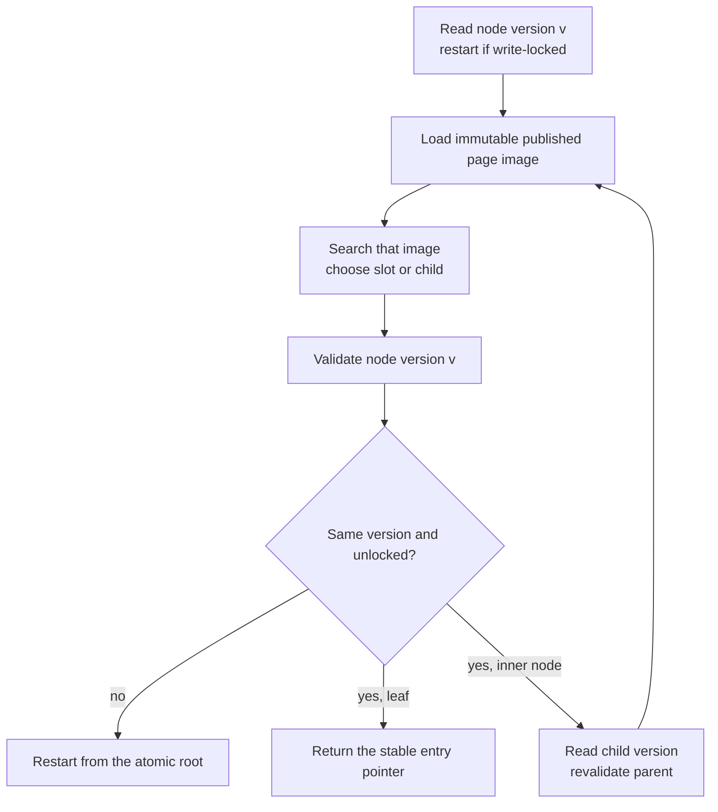

What this diagram shows:

- Readers do not hold a long-lived read latch: they follow **read → inspect →
  validate**.
- A changed or write-locked version discards the tentative result and restarts
  from the atomic root.
- Inner-node traversal couples a validated parent observation to the child's
  version; a validated leaf may return its stable entry pointer.

A writer instead upgrades the expected version to the node's write state,
modifies the working `PageBody`, publishes a new immutable image, and then
unlocks with the next version.

#### Reader/writer page-image example

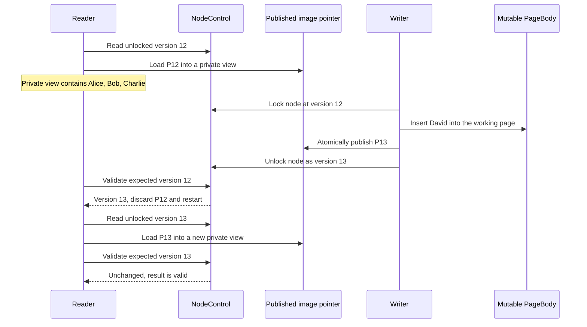

What this diagram shows:

- The reader copies complete image P12 and never examines the writer's mutable
  working page.
- The writer locks version 12, constructs and atomically publishes complete
  image P13, and unlocks as version 13.
- The reader's final validation detects version 13, discards stale P12, and
  retries against P13; it never observes a torn page.
- “Published image” means structurally visible page contents, not MVCC/CID
  publication.

Exact storage: the writer edits `Node::page`; P12/P13 are immutable objects
referenced by `NodeControl::published_page`; version 12/13 and the write state
live in `NodeControl::version_lock`. None of these fields stores transaction
commit state.

This is structural latching, not transaction locking. It protects B+ tree
navigation and splits; the dependency metadata has its own synchronization.

### Exactly which part of the tree is latched?

**The complete root-to-leaf path is never write-latched.** Traversal only reads
and validates node versions. A normal update to an already existing
`DependencyEntry` does not structurally modify the B+ tree at all: it performs
an optimistic lookup and later locks only the out-of-tree metadata entry.

Structural write latches are needed only when a previously unseen normalized
LHS must be inserted into the B+ tree. At the private B+ tree engine boundary:

| Structural situation | Nodes write-latched at the same time | What is not latched |
| --- | --- | --- |
| Lookup of an existing LHS | none | root, inner nodes, and leaf are only version-checked |
| New LHS fits in its leaf | target leaf only | ancestors and other leaves |
| Leaf must split and parent has space | immediate parent + full leaf + newly allocated sibling; previous leaf is validated and try-latched while repairing the bidirectional chain | grandparent and the rest of the path/tree |
| Inner node must split | full inner node + its immediate parent + newly allocated sibling | all more distant ancestors and descendants |
| Parent is also full | current guards are released first; the algorithm retries one level higher | it never accumulates the entire root-to-leaf path |
| Another writer holds a required node | validated try-lock fails and the operation restarts from the atomic root | it does not wait while retaining a lower latch chain |

`NodeWriteGuard` publishes the new immutable page image and increments the node
version when released. Readers that encounter a write-locked or changed node
restart rather than block. For a leaf split, the previous sibling is acquired
with a validated **try-lock** after parent and target are held; failure unwinds
all guards and restarts, avoiding a deadlock-producing wait on a sibling.

The current DV-Tree adds a separate topology rule above those local engine
latches:

| DV-Tree operation | `creation_mutex_` mode | Purpose |
| --- | --- | --- |
| Existing FD key lookup/preparation | none | stable entry lifetime makes a topology guard unnecessary |
| OD footprint construction, preparation, or installation | shared | keeps the predecessor/successor metadata chain unchanged while the interval is inspected or installed |
| First creation of a missing LHS | exclusive | serializes ownership allocation, B+ tree insertion, and metadata-chain splice |

Therefore, the engine is capable of structurally changing disjoint leaves in
parallel, but the current `DVTreeImpl::get_or_create()` deliberately serializes
all first-time LHS creations with the exclusive topology mutex. This mutex does
**not** write-lock the whole B+ tree: ordinary OLC lookups can still run, while
another creator and OD topology readers wait without holding node latches.

#### General concurrent-path example

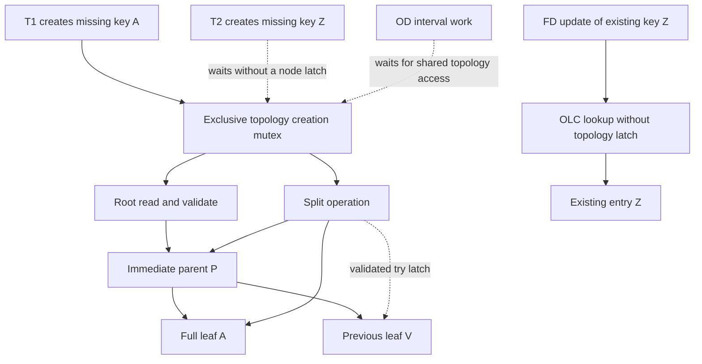

How to read this example:

- T1 owns the exclusive topology mutex because it is creating a missing
  `DependencyEntry`. It traverses through the root without write-latching the
  root. For A's split it latches only immediate parent P and leaf A, constructs
  the new sibling, and try-latches V while repairing the leaf chain.
- T2 also wants to create a new key. It currently waits at the topology mutex
  even though Z may belong to a disjoint leaf; it holds no B+ tree latch while
  waiting.
- OD interval work needs shared topology access and also waits until the chain
  splice is complete.
- An FD update of an already existing Z does not need `creation_mutex_`. Its
  structural lookup remains optimistic; it may briefly restart if T1 changes a
  node on its path, then locks only Z's out-of-tree metadata entry.

#### Worst case: a split cascades to a full root

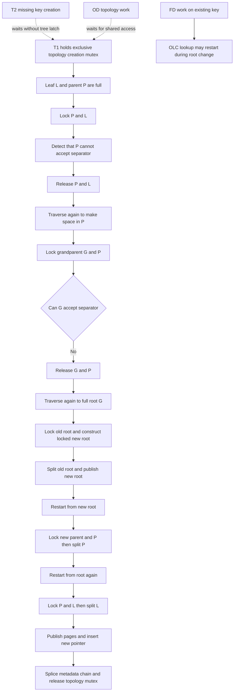

Even in this worst case, the structural engine holds only one split pair at a time
(`target + immediate parent`), plus a new sibling and—only for a leaf split—a
brief previous-leaf try-lock. It releases that pair before moving upward and
restarts after each structural change. A root split is the widest contention
point: while the old/new root is being changed, every traversal that encounters
the locked or changed root restarts. This is temporary global **restart
contention**, not a root-to-leaf tree lock. At the DV layer, however, T1 retains
the exclusive topology mutex across the complete missing-key creation and chain
splice; T2 and OD topology work wait there. Existing-key FD work can continue
after any required OLC restart.

Consequences for overlapping commit paths:

- sharing ancestors does not itself serialize transactions, because ancestors
  are normally only read and version-validated;
- touching the same leaf serializes the short leaf mutation;
- splitting different leaves under the same immediate parent contends on that
  parent and one operation restarts;
- the B+ tree engine can split below different parents concurrently, but the
  current DV-Tree topology mutex serializes separate missing-key creators before
  they reach those engine operations;
- logical FD/OD overlap is independent of physical page overlap: two keys on
  different leaves may still conflict through the same OD interval, while two
  unrelated keys on the same leaf may briefly contend structurally but have no
  transaction-level dependency conflict.

After structural lookup/creation, the transaction-level metadata phases use
these locks:

| Commit phase | Locks held |
| --- | --- |
| Register/check footprint | `registered_mutex_` briefly; it is released before any wait or metadata work |
| Wait for a lower-CID intersection | condition-variable wait; no node, topology, or entry latch remains held |
| Prepare one ready FD key | that key's `DependencyEntry::latch` while copying map/counters/version; private computation follows unlocked |
| Prepare an OD interval | shared `creation_mutex_` plus the affected interval's entry latches in chain order while copying a consistent interval; private candidate state is then retained outside the entries |
| Install FD batch | all prepared FD entry latches in normalized-key order, only through version validation and the non-failing swap |
| Install OD batch | shared `creation_mutex_` plus all interval entry latches, only through topology/version validation and the non-failing swap |
| Complete history prefix | completion/history mutexes only; no B+ tree node or `DependencyEntry` latch |

Code: [OLC traversal and split implementation](../src/storage/dependency_validation/btree/tum_btree/btree.cpp), [node lock/version definitions](../src/storage/dependency_validation/btree/tum_btree/btree.hpp)

Adjusted for DV-Tree:

- one general variable-key layout; mutually alternative experimental TUM
  layouts are not combined;
- `NodeControl` is outside the copyable page body, so compaction cannot copy or
  overwrite active lock/version state;
- readers consume immutable published page images;
- node-level OLC validation and restart logic is explicit;
- leaves have a persistent bidirectional chain for neighbour-aware access;
- splits validated-try-lock the previous leaf before relinking;
- duplicate/oversized keys produce checked errors;
- merging and node reclamation are disabled, so observed pointers stay valid
  until the whole DV-Tree is dropped or rebuilt.

Code: [TUM takeover boundary](../src/storage/dependency_validation/btree/tum_btree/README.md), [page/OLC definitions](../src/storage/dependency_validation/btree/tum_btree/btree.hpp), [adapter](../src/storage/dependency_validation/btree/btree_adapter.hpp)

## 3. Storage model and dependency metadata

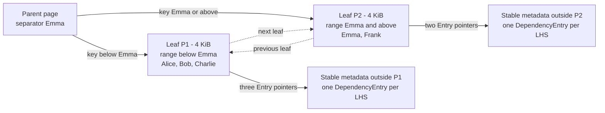

What this diagram shows:

- P1 and P2 are leaf nodes in the same B+ tree; neither represents one LHS.
- The parent separator routes keys below `Emma` to P1 and keys from `Emma`
  onward to P2.
- Bidirectional leaf links support adjacent-page navigation.
- Every leaf key stores a pointer to its own stable, out-of-page
  `DependencyEntry`.

### Zoom into leaf P1

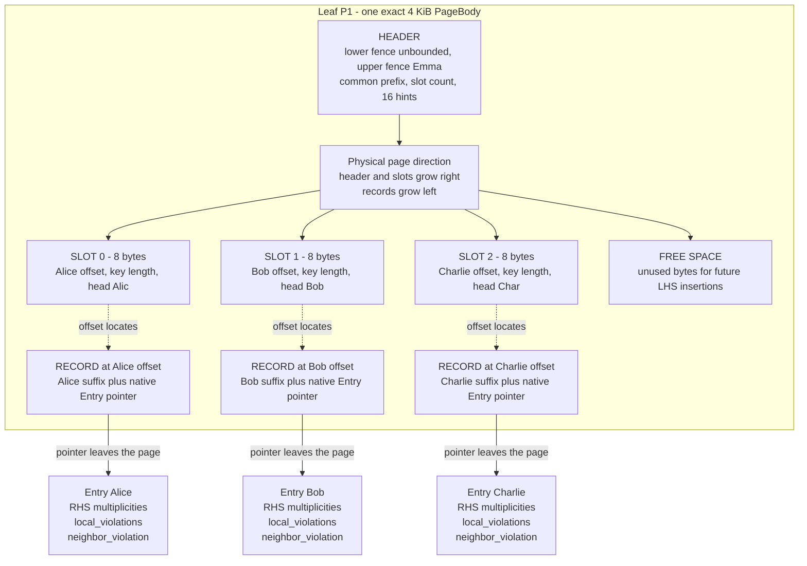

The compact metadata boxes highlight the values used for validation. Every
`DependencyEntry` additionally stores its normalized LHS, commit version,
`nonempty` marker, left/right metadata links, and entry mutex.

What this diagram shows:

1. The parent chooses one leaf page from the normalized LHS.
2. A leaf page owns a **range** and stores many LHS keys—not one page per LHS.
3. Its sorted slots are only small directory entries. Each slot gives the
   offset/length/head of a record elsewhere in the same 4 KiB page.
4. The free region is unused capacity for future LHS insertions. Slots consume
   it from the left and records consume it from the right.
5. The record contains the stored LHS suffix and one native pointer—eight bytes
   on the current 64-bit build.
6. That pointer reaches the stable, out-of-page metadata for exactly one LHS.

Why this boundary matters:

- Page capacity depends on key bytes and one pointer, not on the number or size
  of RHS values.
- Page compaction and splitting move key records containing pointer values; the
  pointed-to metadata objects do not move.
- RHS bytes use append-only stable allocations. The map stores references plus
  duplicate counts.
- An empty determinant remains as a tombstone. This simplifies OLC lifetime and
  OD neighbour correctness. The complete index may later be replaced at a
  quiescent DBMS boundary; DV-Tree performs no online merge or vacuum.

### What the two violation fields mean

For every non-empty LHS group `k`:

```text
local_violations(k) = max(0, number of distinct RHS values at k - 1)

neighbor_violation(k) =
    1  if max(RHS(k)) > min(RHS(next non-empty LHS))
    0  otherwise, including when no successor exists

FD score = sum(local_violations)
OD score = sum(local_violations + neighbor_violation)
```

The neighbour flag represents the outgoing boundary and is stored on its left
entry. It is not a second, complete “OD violations” counter. For example:

```text
Alice → {10 × 1, 20 × 2}       Bob → {15 × 1}

Alice.local_violations   = 1   two distinct RHS values
Alice.neighbor_violation = 1   max(Alice)=20 > min(Bob)=15
Bob.local_violations     = 0
Bob.neighbor_violation   = 0   no following non-empty LHS

FD score for this data = 1   if evaluated by an FD tree
OD score for this data = 2   if evaluated by an OD tree
```

Duplicate multiplicity is retained for correct deletion, but duplicates of the
same RHS do not increase `local_violations`.

Code: [`DependencyEntry`](../src/storage/dependency_validation/dependency_entry.hpp), [stable RHS storage](../src/storage/dependency_validation/rhs_storage.hpp)

## 4. Key normalization

All scalar and composite LHS/RHS values become self-delimiting byte strings
whose lexicographic order is the intended logical order. Only normalized LHS
bytes enter the B+ tree; normalized RHS bytes are ordered inside the metadata
map:

- each column starts with `0x01` for a value or `0x02` for `NULL` → fixed
  ascending `NULLS LAST`;
- signed integers flip the sign bit and are stored big-endian;
- floats use DuckDB-style radix encoding: one canonical zero, one canonical NaN,
  infinities at the endpoints, and sortable transformed bits;
- strings escape data `0x00` as `0x00 0xFF` and end with `0x00 0x01`;
- composite keys concatenate these independently delimited columns.

Consequences: scalar and composite dependencies use the same tree; byte equality
also defines the configured `NULL`/NaN equality policy.

### Composite example

For the tuple `(-2, "A\0B", NULL)`, the schematic encoding is:

```text
column 1: valid int32 -2     → 01 7F FF FF FE
column 2: valid "A\0B"       → 01 41 00 FF 42 00 01
column 3: NULL               → 02

composite key:
01 7F FF FF FE | 01 41 00 FF 42 00 01 | 02
```

The `00 FF` pair escapes the zero byte inside the string; `00 01` terminates the
column. Consequently, `("a", "bc")` and `("ab", "c")` cannot collapse to the
same concatenated key. The validity markers also make a real value distinct
from `NULL` without dropping the row.

### One row change through all layers

```text
insert: LHS=(customer 42, region "EU"), RHS=status 3

1. normalize LHS → K_L; normalize RHS → K_R
2. use K_L to find one DependencyEntry through the B+ tree
3. copy that entry's RHS map into the ticket's private preparation
4. add K_R privately; recompute the local term and, for OD, affected boundaries
5. register the complete key/OD-interval footprint and wait only for lower-CID
   intersections; unrelated keys may continue immediately
6. validate the observed entry/topology versions and install the complete
   metadata batch; the consecutive completion drain later records the
   cumulative history total and advances the visible CID
```

Only step 2 concerns B+ tree navigation. Steps 3–6 belong to the dependency and
MVCC layer; the RHS value itself is never placed in the B+ tree page.

Exact storage: normalization first produces owned `std::string` fields
`Transaction::Op::lhs_norm` and `rhs_norm`. At key creation, the LHS is copied
into stable `DependencyEntry::lhs` and its page suffix is stored in the leaf
record. Distinct RHS bytes are copied into `StableRhsStorage`; committed and
private maps store `RhsRef` pointer/length pairs into those allocations.

Code: [composite construction](../src/storage/dependency_validation/normalized_key.hpp), [scalar encodings](../src/storage/dependency_validation/key_normalization.cpp)

## 5. Snapshot Isolation, MVCC, and concurrency

> [!important] Scope of the MVCC claim
> DV-Tree is a versioned **dependency-verdict index**, not a row store. The DBMS
> owns row versions, write-conflict detection, rollback, and transaction
> snapshots. DV-Tree stores cumulative verdict totals only at CIDs where the
> score changes and advances its visible watermark for every completed CID,
> including no-ops. For every retained snapshot `s`, the last change point at or
> before `s` gives the exact aggregate verdict.

A small history example:

```text
CID 9:  total 0
CID 10: delta +2, total_after 2  → snapshot 10 returns 2
CID 11: delta -1, total_after 1  → snapshot 11 returns 1
CID 12: delta  0                 → snapshot 12 still returns 1; no entry needed
```

If a snapshot is older than the retained exact-history horizon,
`violations_exact()` rejects it rather than pretending to reconstruct it.

### Snapshot-history capacity and exact answers

The current history is already buffer-like, but it is not a fixed overwriting
ring. `VersionedViolationHistory::entries_` is a `deque` with a default **soft
capacity of 512 score-changing CIDs**. A zero-delta commit consumes no history
entry, and multiple updates for the same CID coalesce.

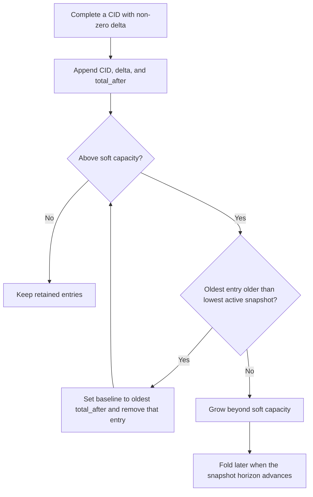

What this diagram shows:

- “Capacity” is a target, not a correctness boundary. A commit is not rejected
  merely because an active snapshot protects more than 512 change points.
- An eligible old cumulative total is folded into `baseline_`, which preserves the
  aggregate score at every still-supported snapshot while releasing its
  individual deque entry.
- If the oldest delta is still required, the deque grows. When Hyrise later
  advances or clears the lowest-active-snapshot horizon, folding resumes.
- A fixed circular buffer would be safe only with this same horizon check. Blind
  overwrite would make long-running snapshot answers incorrect.

For example, with lowest active snapshot 10:

```text
Before: baseline = 0, entries = [CID 1:total 1] [CID 5:total 3]
                                [CID 10:total 2] [CID 20:total 3]
After:  baseline = 3, entries = [CID 10:total 2] [CID 20:total 3]
```

Hyrise must feed its global lowest active snapshot into
`set_lowest_active_snapshot()`. A long-running snapshot can therefore increase
memory use, but it cannot silently lose its exact verdict.

Given a transaction snapshot CID `S`, the production query is
`violations_exact(S)` or its Boolean wrapper `holds_exact(S)`:

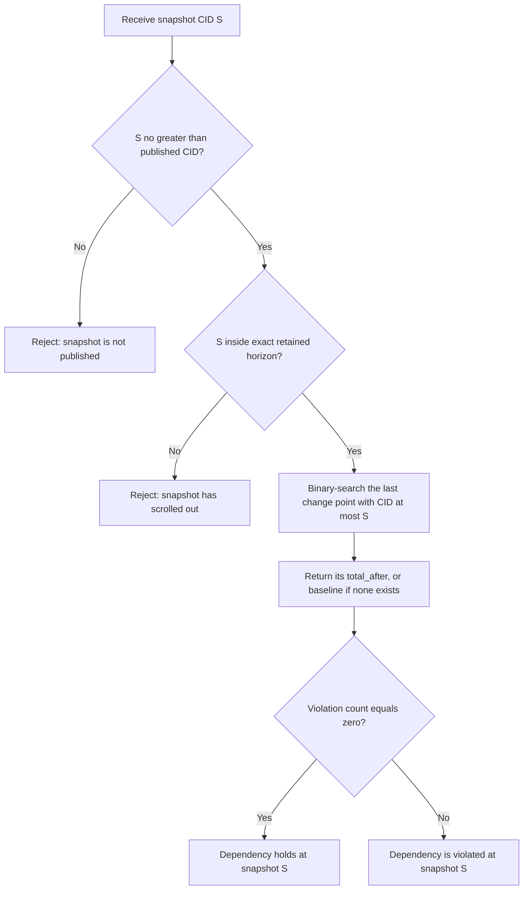

What this diagram shows:

- The acquire-read of `visible_commit_cid_` prevents a query from observing a
  CID whose transaction/history completion has not reached the visible prefix.
- The exact-horizon check prevents an answer for a snapshot older than the
  folded information can distinguish.
- The query takes the history's shared latch and performs `upper_bound(S)` over
  cumulative totals. It does not rescan earlier deltas or traverse B+ tree
  entries.
- The result is an aggregate answer: zero means the configured dependency holds;
  a positive count means it does not. Historical per-LHS explanations would
  require per-entry version histories, which the current implementation does
  not store.

The plain `holds(S)` and `violations(S)` helpers do not enforce both publication
and exact-horizon guards; Hyrise should use the `_exact` API. Physically disjoint
transactions may finish out of order, but their envelopes remain in
`registered_commits_`; only the ready consecutive completion prefix appends to
the retained history, so cumulative totals never require suffix repair.

Code: [versioned violation history](../src/storage/dependency_validation/versioned_history.hpp), [snapshot-query API](../src/storage/dependency_validation/dv_tree.hpp), [reservation, installation, and query implementation](../src/storage/dependency_validation/dv_tree_impl.hpp)

### Commit lifecycle

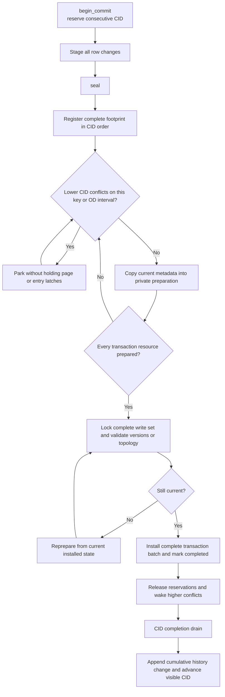

What this diagram shows:

- Standalone tickets reserve CIDs before staging, so footprint registration is
  itself advanced in CID order; Hyrise integration should collect the footprint
  first and combine CID assignment with registration.
- FD preparation is per LHS: a transaction may copy free keys while another key
  waits. OD uses one conservative predecessor–successor interval because its
  neighbour flags are coupled.
- Waiting uses `condition_variable`; no B+ tree node latch, entry mutex, or
  topology latch is held while parked.
- Entry images install as one complete batch after version/topology validation.
  Disjoint higher CIDs may therefore install before a lower unresolved CID.
- Only the small history/visible-CID completion prefix remains serialized; it
  never installs dependency entries.

Where this lifecycle state is stored:

- before `seal()`, staged operations are in
  `DVTreeImpl::CommitTicket::transaction_.ops` behind the public ticket façade;
- after registration, the transaction, footprint, status, and pending aggregate
  delta are in its heap `CommitEnvelope`, indexed by `registered_commits_[cid]`;
- ready FD key copies are in `CommitEnvelope::fd_prepared_by_key`; an OD interval
  candidate is execution-local because the whole interval waits together;
- after batch installation, stable `DependencyEntry` objects contain the newest
  physical metadata and may carry a CID above the visible prefix;
- after consecutive completion retirement, a non-zero `{cid, delta,
  total_after}` record is in `history_.entries_` and
  `visible_commit_cid_` exposes that prefix to exact snapshot queries.

### How overlap is calculated after CID reservation

In the standalone API, `begin_commit()` first reserves the CID. The transaction
then stages its operations. At `seal()`, DV-Tree builds the complete footprint
from the normalized LHS keys and registers sealed footprints in consecutive CID
order before any higher CID may use them for scheduling:

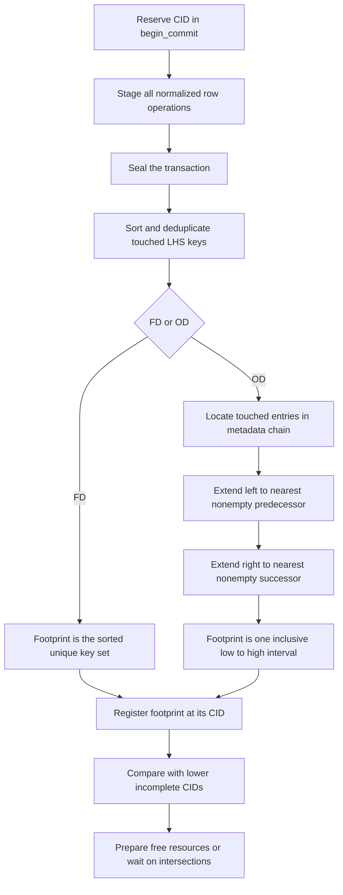

For FD, each footprint is a sorted unique key set. Two transactions overlap if
the sets share at least one normalized LHS:

```text
CID 10 keys = [A, C]
CID 11 keys = [B, C]
intersection = [C]

Result: CID 11 may prepare B immediately, but must wait for CID 10 before
        copying C.
```

The implementation uses a two-pointer intersection test for complete FD
footprints. During per-key preparation it uses binary search against each lower
incomplete footprint, allowing the free key B to make progress independently.

For OD, a touched key can change predecessor/successor neighbour flags outside
the directly touched set. The footprint is therefore a conservative inclusive
interval:

```text
metadata chain:  A -- B -- C -- D -- E

CID 10 touches B  -> interval [A, C]
CID 11 touches D  -> interval [C, E]

The intervals share C, so they overlap and CID 11 waits.
```

Formally, inclusive intervals `[low1, high1]` and `[low2, high2]` overlap unless
`high1 < low2` or `high2 < low1` in normalized byte order. Empty footprints do
not conflict. A footprint whose construction failed is marked
`conservative_all`, which conflicts with everything until that CID is aborted
or otherwise resolved.

Only **lower, registered, incomplete** CIDs are considered blockers. Once the
lower transaction completes or aborts, it no longer blocks the resource and
`registered_cv_` wakes waiters. The standalone's `registration_driver_mutex_`
exists because CID reservation precedes staging: it prevents CID 11 from being
registered before CID 10 has sealed and registered its complete footprint. The
planned Hyrise integration can instead construct the footprint first and make
CID assignment plus registration one atomic scheduling step.

Code: [`build_commit_footprint()` and overlap predicates](../src/storage/dependency_validation/dv_tree_impl.hpp), [mixed-footprint concurrency regression](../tests/concurrency/concurrency_tests.cpp)

### Current reservation and completion components

Metadata installation is scheduled by resource conflicts rather than by one
CID-ordered installer:

- `registered_commits_` is both the footprint registry and the small pending
  completion map;
- `registration_driver_mutex_` makes the standalone's delayed footprint
  registration unambiguous despite tickets reserving CIDs before staging;
- conflict predicates inspect only lower, registered, incomplete footprints;
- `registered_cv_` parks and wakes conflicting transactions;
- `completion_driver_mutex_` protects `advance_completed_prefix()`, which only
  appends cumulative history and advances `visible_commit_cid_` for consecutive
  completed/aborted envelopes.

Physical metadata installation is conflict-ordered, while snapshot visibility
remains a consecutive Hyrise-style CID prefix. The ordered drain performs only
history/visibility bookkeeping and never installs dependency metadata.

### What is latched or locked?

| Area | Read/prepare behaviour | Write/installation behaviour |
| --- | --- | --- |
| B+ tree structure | OLC: read node version, inspect immutable page image, validate; restart on change | write-latch only affected nodes; a split holds parent + target and try-locks the previous leaf |
| Footprint registry | short registry mutex to compare complete lower-CID footprints | a logical key/interval reservation remains until the transaction completes; a waiter parks on `registered_cv_` and holds no page or entry latch |
| Metadata entry | short mutex while copying the RHS map, counters, and version into private preparation | the complete write set is reacquired in key order, validated, and installed as one non-failing batch; entry locks are then released |
| OD topology | shared while finding/copying the affected predecessor–successor interval | exclusive only when creating/splicing a new `DependencyEntry`; an overlapping lower-CID interval is also a logical reservation |
| Commit order | disjoint higher CIDs may prepare and physically install early | intersecting resources follow CID order; only the short completion/history drain waits for a consecutive completed prefix |
| Snapshot history | concurrent readers use a shared history latch and binary-search cumulative totals | completion append and horizon folding use the exclusive side; neither holds B+ tree or entry latches |

Terminology: a **node latch** protects physical tree structure for a short
operation; an **entry mutex** protects one logical metadata image during a copy
or install. A **reservation** is longer-lived logical scheduling state in the
CID/footprint registry. It does not keep a CPU mutex or page latch locked while
a transaction waits. Snapshot visibility is the consecutive completed CID
prefix, not the newest physically installed entry version.

### One commit without interference

1. `begin_commit()` reserves CID 10.
2. T1 stages all row changes.
3. `seal()` constructs and registers T1's complete normalized footprint.
4. With no lower-CID intersection, T1 copies the affected metadata under short
   entry locks and computes a private final image and violation delta.
5. DV-Tree reacquires the complete write set, validates entry/topology versions,
   installs the batch, stamps changed entries with version 10, and releases the
   physical locks.
6. T1 marks its envelope complete and releases its logical reservations.
7. The completion drain appends `{10, delta, total_after}` when non-zero and
   release-stores `visible_cid = 10`. Before that store, exact verdict reads
   still query snapshot 9.

### Publisher-free overlapping arrival: T2 reaches X first

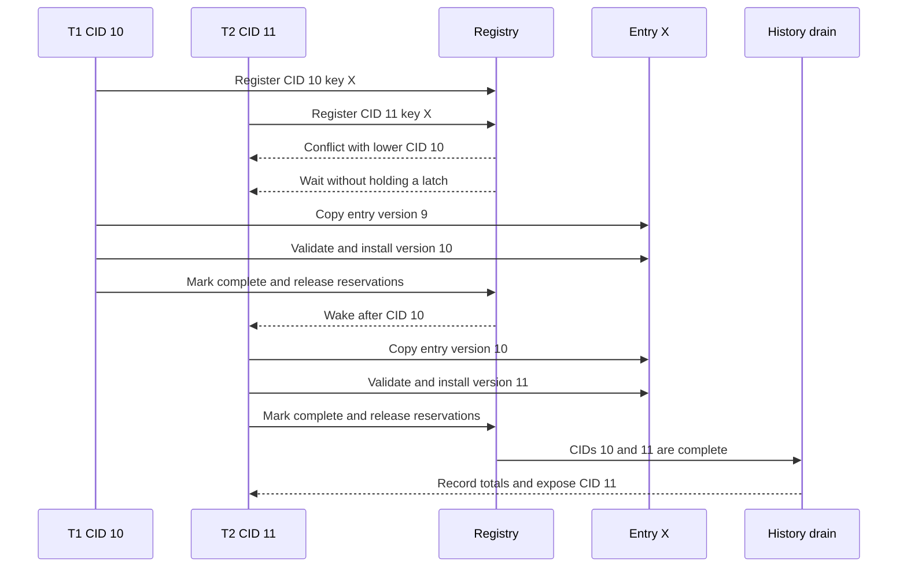

What this diagram shows:

- T1/CID 10 owns the earlier logical reservation for X even if its worker takes
  longer to arrive at X.
- T2/CID 11 discovers the intersection before copying X, so it cannot construct
  a stale version-9 preparation for that resource.
- T2 parks without holding a B+ tree latch or `DependencyEntry` mutex. It wakes
  after T1 installs version 10 and releases the reservation.
- T2 then copies version 10, validates it, and installs version 11. Version
  validation remains a safety net for structural/topology races.

The affected-resource order therefore follows CID order without serializing
unrelated resources.

Exact storage during this sequence: each transaction has a heap
`CommitEnvelope` referenced by `registered_commits_[cid]`; its footprint is in
`CommitEnvelope::footprint`. T1's copied X map and observed version 9 live in
`fd_prepared_by_key[X]`. T2 has no private X image while parked; after waking,
its copied map and observed version 10 live in its own `fd_prepared_by_key[X]`.
X itself stores only the installed latest metadata and version. Completed
deltas wait in their envelopes until the completion drain writes cumulative
change points to `history_.entries_`.

### Mixed footprint: T2 prepares Y while X is blocked

This is the important middle case between complete overlap and complete
disjointness. T1/CID 10 touches X. T2/CID 11 touches both X and Y:

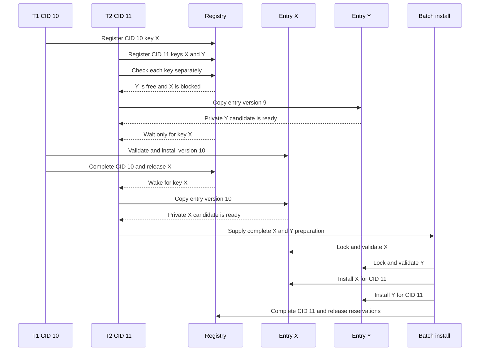

T2 does useful private work on Y instead of blocking its whole transaction.
However, it does **not** install Y early: its Y candidate remains in
`CommitEnvelope::fd_prepared_by_key[Y]`. After X becomes available, T2 prepares
X, combines both candidates, locks and validates the complete entry set, and
installs the transaction atomically. This preserves transaction atomicity while
still overlapping the expensive copy/computation phase.

### Publisher-free disjoint arrival: T2 reaches Z first

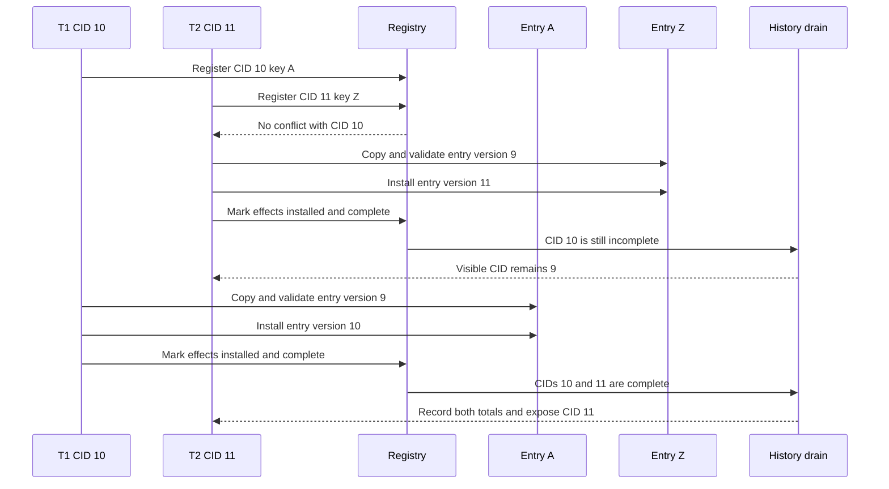

What this diagram shows:

- T2 does not wait merely because T1 owns a lower CID. `{A}` and `{Z}` do not
  intersect, so T2 may copy, validate, and install Z while T1 is still running.
- Physical metadata can therefore be at Z/version 11 while the exact snapshot
  visibility boundary is still CID 9.
- Snapshot 11 is not answerable as visible until CID 10 also completes. The
  completion drain then records totals for 10 and 11 in order and advances the
  visible prefix to 11.
- `snapshot_entry(Z)` is a latest-installed diagnostic. Snapshot-isolated
  dependency verdicts must use `violations_exact(S)`/`holds_exact(S)`.

For OD, the footprints are conservative inclusive predecessor–successor
intervals rather than single keys. Disjoint intervals can run concurrently;
overlap waits for the lower CID. A changed topology epoch still causes a
conservative retry before installation.

Exact storage: T1 and T2 remain separate envelopes in `registered_commits_`.
T2's installed delta and completion flag stay in its envelope while CID 10 is
unfinished; no out-of-order item is inserted into the cumulative deque. When
T1 completes, `advance_completed_prefix()` consumes both envelopes and appends
the two history change points in CID order.

| Question | Overlapping example | Disjoint example |
| --- | --- | --- |
| What does CID 10 change? | The same entry/OD interval observed by CID 11 | A different entry/OD interval |
| CID 11 scheduling | Waits before preparing the conflicting resource | Proceeds and may install before CID 10 |
| CID 11 entry version | Copies the state after CID 10 | Copies its independent current state |
| What remains serialized? | This resource plus completion/history prefix | Completion/history prefix only |

Code: [ticket, reservation, and installation implementation](../src/storage/dependency_validation/dv_tree_impl.hpp), [versioned history](../src/storage/dependency_validation/versioned_history.hpp), [concurrency regressions](../tests/concurrency/concurrency_tests.cpp)

## 6. Hyrise integration target and reviewed-path comparison

| Reviewed Hyrise path | Standalone DV-Tree | Why it matters |
| --- | --- | --- |
| Separate single-column `_val_tree` and composite `_multi_val_state` | one shared implementation; one `DVTree` configured as FD or OD per dependency, for every arity | removes semantic drift and duplicate code paths without mixing dependencies |
| per-row insert/delete validation callbacks | transaction-wide fragment collection, complete footprint registration, and one atomic metadata batch | no partial transaction becomes visible and conflicts are known before either transaction installs them |
| later CID work could reach the same metadata before an earlier, slower transaction | lower-CID key/OD-interval reservations make intersecting work wait; disjoint work may install early; versions are revalidated | preserves CID order exactly where effects interact without globally serializing all dependency work |
| variable validation state coupled too closely to fixed pages/buffers | fixed pointer in the page; unbounded RHS metadata out of line | avoids page/scratch-buffer overflow and metadata movement during splits |
| unsafe optimistic parse/sibling cases from the review | immutable page images, validate-before-use, restart, and locked relinking | closes torn/stale structural-read windows |
| bounded delta history could overwrite an active snapshot window or require a scan | cumulative `{CID,total_after}` change points, soft capacity, and lowest-active-snapshot folding | retained snapshots stay exact and an answer is found by binary search |
| incomplete/ad-hoc composite and NULL encoding | one documented normalized byte order | all arities and boundary values share one comparator |

### How the chosen protocol fits Hyrise

Hyrise already assigns consecutive CIDs and advances a global visible-CID
prefix. The chosen design leaves that mechanism unchanged. DV-Tree performs
all dependency work before the transaction marks its existing `CommitContext`
pending:

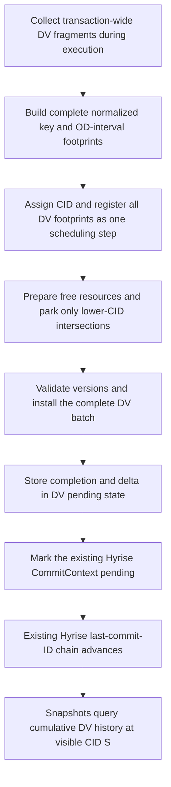

What this diagram shows:

- Hyrise does not need a new pre-CAS publisher callback or publisher thread.
- A transaction without DV changes skips steps B–F and follows Hyrise's normal
  commit path.
- A transaction with DV changes must finish its complete DV batch before it is
  allowed to become pending in Hyrise's commit chain.
- Assigning the CID and registering the complete footprint must be atomic from
  the reservation protocol's point of view. Otherwise CID 11 could inspect the
  registry before CID 10's footprint exists.
- Once both row MVCC work and DV work are ready, Hyrise's existing consecutive
  `_last_commit_id` advancement remains the global snapshot-visibility point.

The standalone API currently reserves a ticket CID before all fragments have
been staged. It closes that temporary knowledge gap with
`registration_driver_mutex_` and registers sealed footprints in consecutive CID
order. Hyrise can use the cleaner integration boundary: first construct the
transaction-wide footprint, then assign/register the CID as one step.

### Same-row conflicts versus dependency conflicts

The protocol deliberately leaves physical row ownership to Hyrise and handles
logical dependency interactions inside DV-Tree:

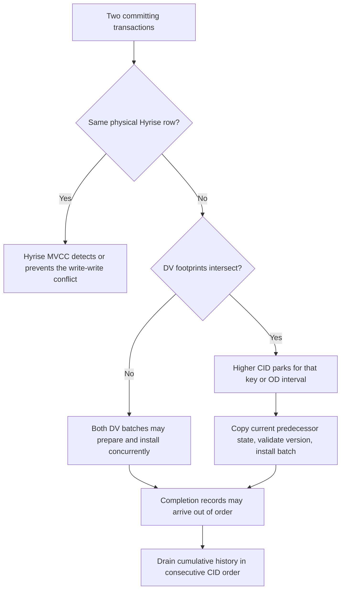

What this diagram shows:

- Updating the same row is not solved by a DV entry version; Hyrise's row MVCC
  is authoritative for that write-write conflict.
- Different rows can still affect the same FD key or OD neighbor interval. That
  is the DV-Tree reservation protocol's responsibility.
- Entry/topology versions validate that the state copied for installation is
  still current. They complement reservations; they do not replace them.
- The cumulative history stores the aggregate dependency verdict per visible
  change point, not a complete historical RHS map for every key and CID.

### Current Hyrise path versus required integration path

> [!note] Comparison boundary
> The first diagram documents the reviewed pre-DV-Tree validation path that must
> be replaced. It is retained here only because the contrast explains the
> integration change; it is not part of the target design.

**Reviewed pre-DV-Tree Hyrise path**

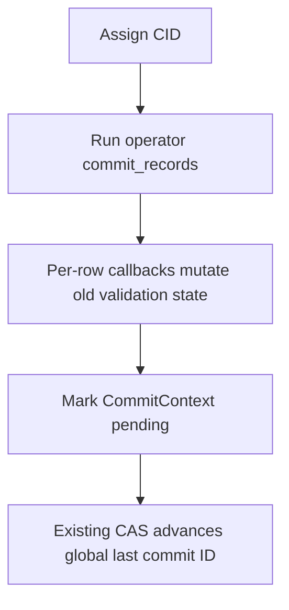

**Required DV-Tree path without a new publisher**

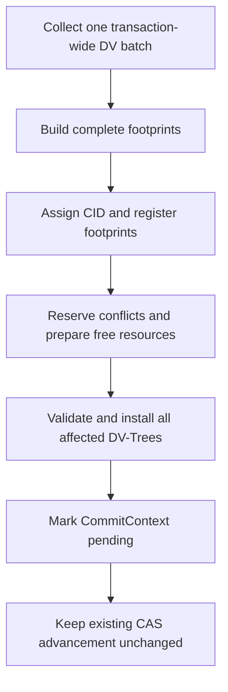

What this diagram shows:

- The defect is not Hyrise's final CAS ordering. It is that the reviewed path
  mutates dependency state per row before the transaction-wide dependency
  effect and its conflicts are known.
- The replacement collects first, schedules by complete footprint, and installs
  a complete transaction batch before the existing pending/visibility step.
- There is no new DV callback between the CAS and visibility, and the existing
  post-commit callback is not used as a publisher.

Where the relevant state is stored:

- Hyrise's global visibility watermark remains
  `TransactionManager::_last_commit_id`;
- the assigned CID, pending state, successor link, and post-commit callback
  remain in `CommitContext`;
- transaction-wide normalized DV fragments and footprints need a new owner in
  `TransactionContext` or a dedicated batch object owned by it;
- each affected DV-Tree stores its registered envelope/footprint and installed
  delta until the per-tree completion prefix can append cumulative history;
- the lowest active Hyrise snapshot is propagated to each DV-Tree's retention
  horizon.

### Integration boundary

The principal integration proof obligation is the transaction-wide,
possibly multi-DV-Tree batch boundary. The standalone proves per-tree footprint
scheduling, wait discipline, version validation, atomic entry-set installation,
cumulative history, and the snapshot-visible completion prefix. Hyrise must
provide transaction-wide fragment ownership, atomic CID/footprint registration,
and atomic installation across every dependency tree touched by one transaction.

The concrete remaining work is tracked in [In-Hyrise implementation TODOs](#in-hyrise-implementation-todos).

Reviewed code: `Hyrise transaction manager`, `commit context`, `transaction context`, `B-tree index header`, `insert callback`, `delete callback`, [review closure matrix](FORMER_HYRISE_FINDINGS_CLOSURE.md)

## 7. Provenance: what came from where?

DV-Tree is not a wholesale copy of any one system. It combines a copied and
adapted structural page engine with independently implemented normalization,
OLC hardening, dependency metadata, and MVCC/SI coordination.

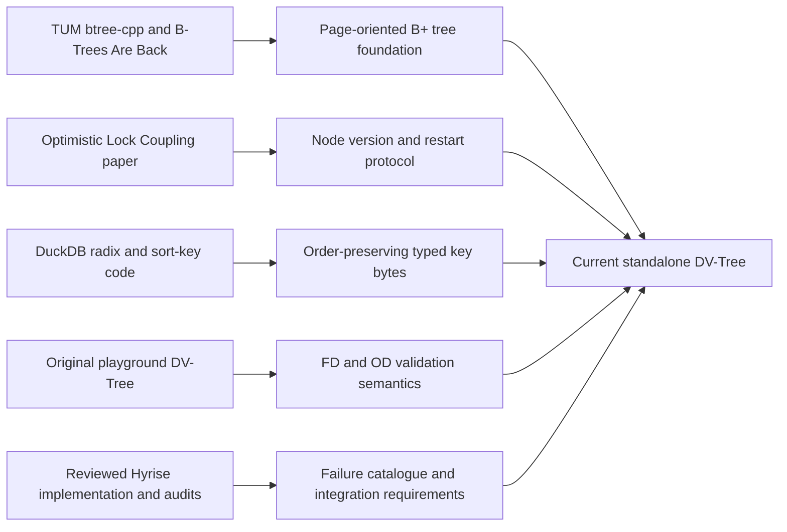

### Source and ownership matrix

| Current component | External/reference foundation | Retained or adapted idea | Added specifically in this project | Current code |
| --- | --- | --- | --- | --- |
| Basic B+ tree page engine | TUM [`btree-cpp`](https://github.com/m-mueller678/btree-cpp) and Müller, Benson, Leis, *B-Trees Are Back* | exact 4 KiB slotted pages, lower/upper fences, prefix truncation, four-byte heads, 16 hints, variable-key compaction, separator selection, split layout, fixed pointer payload | copied into an owned standalone subtree; alternative dense/fingerprint/adaptive layouts omitted; checked duplicate/oversized-key errors; fixed DV pointer payload specialization | [`src/btree/tum_btree/`](../src/storage/dependency_validation/btree/tum_btree/README.md) |
| Structural OLC | Leis, Haubenschild, Neumann, *Optimistic Lock Coupling* (2019); the former Hyrise OLC tree and audit were comparison material | per-node version/write word, optimistic read-validate-restart, parent-before-child validation, short writer ownership | `NodeControl` separated from `PageBody`; immutable published page images; child-version coupling; bounded restart/backoff; checked root changes; previous-leaf validated try-lock; split failure/restart tests; stable lifetime by disabling merge/reclamation | [`btree.hpp`](../src/storage/dependency_validation/btree/tum_btree/btree.hpp), [`btree.cpp`](../src/storage/dependency_validation/btree/tum_btree/btree.cpp) |
| Numeric and nullable normalization | DuckDB [`create_sort_key.cpp`](https://github.com/duckdb/duckdb/blob/main/src/function/scalar/create_sort_key.cpp), [`sort_key.hpp`](https://github.com/duckdb/duckdb/blob/main/src/include/duckdb/common/sorting/sort_key.hpp), and DuckDB radix encoders | order-preserving big-endian numeric bytes; sign transformation; canonical floating zero and NaN; explicit validity ordering | one immutable `ASC NULLS LAST` policy; literal/`IS NOT DISTINCT FROM` NULL equality for dependency keys; the policy is fixed for the index lifetime | [`key_normalization.cpp`](../src/storage/dependency_validation/key_normalization.cpp), [`key_normalization.hpp`](../src/storage/dependency_validation/key_normalization.hpp) |
| Composite and string framing | normalization work from the original playground plus OrderedCode/FoundationDB-style zero escaping; DuckDB was the ordering reference but its VARCHAR byte-plus-one framing was not copied | self-delimiting concatenation of normalized columns | binary-safe `00 FF` escaping for embedded zero and `00 01` column terminator, preserving arbitrary `std::string` bytes including `FF`; per-column validity markers prevent composite ambiguity | [`normalized_key.hpp`](../src/storage/dependency_validation/normalized_key.hpp), [`key_normalization.cpp`](../src/storage/dependency_validation/key_normalization.cpp) |
| FD and OD semantics | dependency algorithms and regression intent from the original `playground`; former Hyrise implementation supplied comparison cases and defects to avoid | FD local term from distinct RHS values; OD local term plus successor-neighbour term; insert/remove/update transaction intent | one implementation for scalar and composite keys; stable out-of-page `DependencyEntry`; RHS multiplicities; tombstone-aware neighbour chain; exact affected-interval recomputation; independent batch oracle | [`dependency_entry.hpp`](../src/storage/dependency_validation/dependency_entry.hpp), [`dv_tree_impl.hpp`](../src/storage/dependency_validation/dv_tree_impl.hpp) |
| MVCC and snapshot verdict history | Hyrise's global CID/snapshot model and the earlier audit requirements; no existing implementation was copied as the final protocol | committed-prefix visibility and oldest-active-snapshot retention requirement | cumulative `{CID, total_after}` change points, soft capacity, baseline folding, exact-horizon checks, binary-search snapshot answers | [`versioned_history.hpp`](../src/storage/dependency_validation/versioned_history.hpp), [`dv_tree.hpp`](../src/storage/dependency_validation/dv_tree.hpp) |
| Publisher-free commit coordination | designed for this work from the CID-ordering problems identified in the Hyrise/playground audits | transaction-wide batching and version validation as required correctness principles | complete FD-key/OD-interval footprints; lower-CID intersection waits; per-key private preparation; condition-variable wakeup without latches; disjoint early installation; atomic per-tree metadata batch; consecutive completion/history drain | [`dv_tree_impl.hpp`](../src/storage/dependency_validation/dv_tree_impl.hpp), [`concurrency_tests.cpp`](../tests/concurrency/concurrency_tests.cpp) |
| Hyrise integration contract | current Hyrise `TransactionManager`, `CommitContext`, operators, row MVCC, and the reviewed old validation index | Hyrise remains CID authority, row-write-conflict authority, and global snapshot-visibility authority | proposed transaction-owned DV batch, atomic CID/footprint registration, multi-DV-Tree non-failing installation, lowest-active-snapshot propagation; no new Hyrise publisher hook | this is documented integration work, not compiled into the standalone project |

### Important ownership boundaries

- The files under `src/btree/tum_btree/` are an **adapted source takeover** of
  the basic TUM engine, not an untouched dependency and not code linked from the
  original repository.
- The OLC synchronization code is project-owned implementation guided by the
  OLC paper and hardened against the former Hyrise review findings; it is not a
  claim that the paper supplied immutable page images or DV-specific locking.
- Only the numeric/radix ordering policy is DuckDB-derived. Binary-safe string
  framing, composite construction, dependency semantics, metadata storage, and
  MVCC scheduling are explicit DV-Tree decisions.
- The former Hyrise DV index is a requirements and failure reference. Its
  `_val_tree`, `_multi_val_state`, inline variable payloads, and per-row mutation
  paths are deliberately not carried forward.
- TUM `btree-cpp` identifies itself as a research artifact. Licensing and
  redistribution terms must be resolved before this adapted source is shipped
  beyond the research project.

## 8. Implementation TODOs

### Standalone implementation TODOs

> [!success] Correctness status
> No known single-DV-Tree correctness item from the former audits remains open
> in the standalone implementation. The remaining standalone work concerns
> performance/production qualification and source-distribution policy.

Completed standalone acceptance items:

- [x] Adopt the TUM variable-key 4 KiB page foundation without modifying the
  original `btree-cpp` checkout.
- [x] Add immutable page images, node-version OLC, validate-before-use traversal,
  safe split relinking, and stable non-reclaimed pointer lifetimes.
- [x] Store one fixed pointer in each leaf record and all unbounded dependency
  metadata out of page.
- [x] Implement normalized scalar/composite keys with fixed NULL, NaN, infinity,
  signed-zero, and binary-string semantics.
- [x] Unify FD/OD and scalar/composite dependency maintenance in one `DVTree`.
- [x] Implement complete footprints, lower-CID conflict reservation, per-key FD
  preparation, conservative OD intervals, version validation, and atomic
  per-tree installation.
- [x] Implement cumulative exact-snapshot history with a soft retention target
  and lowest-active-snapshot horizon.
- [x] Cover the former A1–A6/C5 findings plus overlap, mixed-footprint, disjoint
  early-installation, error/abort, history-growth, sanitizer, threaded, and TSan
  regressions.

Completed standalone API cleanup:

- [x] Remove the legacy externally driven coordinator, caller-assigned-CID
  overload, implicit row builder, and duplicate direct transaction path.
- [x] Use completion/visibility terminology (`visible_commit_cid_`,
  `visible_commit_id()`, and `wait_until_visible()`) consistently.
- [x] Freeze one reservation/version commit path and keep raw metadata/history
  inspection behind `DV_TESTING`.

Remaining standalone qualification:
- [x] Add concurrent memory accounting for pages, stable entries, RHS storage,
  private preparations, pending envelopes, and retained history.
- [ ] Benchmark FD key-level parallelism, OD interval width, split contention,
  long snapshot windows, and high-thread-count completion-drain contention.
- [ ] Measure the conservative global `creation_mutex_`; if first-time key
  creation becomes a bottleneck, design finer-grained topology insertion without
  weakening stable neighbour-chain semantics.
- [ ] Run longer randomized/fuzz and failure-injection campaigns on the final
  supported compilers and deployment architectures.
- [ ] Resolve TUM `btree-cpp` licensing and redistribution requirements before
  shipping the adapted source beyond the research project.

Explicitly **not** standalone TODOs: online merge, node reclamation, and index
vacuuming. The current lifetime policy is deliberate; a host DBMS may recover
memory by rebuilding/replacing the complete index at a quiescent boundary.

### In-Hyrise implementation TODOs

- [ ] Define ownership: instantiate exactly one FD- or OD-configured `DVTree`
  per registered dependency and attach its lifetime to the owning table.
- [ ] Add a transaction-owned dependency batch, likely in `TransactionContext`
  or a dedicated object owned by it, that collects normalized changes from every
  relevant operator.
- [ ] Replace per-row dependency mutation in Insert/Delete commit callbacks with
  fragment collection only.
- [ ] Map every required Hyrise data type to the standalone normalized-key
  contract and enforce the chosen NULL/NaN policy before staging operations.
- [ ] Build the complete sorted FD key set or conservative OD neighbour interval
  for every affected dependency before dependency execution begins.
- [ ] Integrate Hyrise CID assignment with footprint registration so a later CID
  can never observe an unregistered lower-CID footprint. This needs an atomic
  scheduling boundary or short registration barrier, not a new visibility
  publisher.
- [ ] Run the publisher-free reservation protocol before the transaction's
  existing `CommitContext` becomes pending; never wait while holding Hyrise row,
  B+ tree node, or dependency-entry latches.
- [ ] Design the multi-DV-Tree transaction boundary: preallocate and validate all
  affected trees, then perform a non-failing install phase, or implement a
  coordinated commit-marker/rollback protocol.
- [ ] Keep Hyrise row MVCC authoritative for same-row write/write conflicts and
  keep `_try_increment_last_commit_id()` as the global visibility mechanism.
- [ ] Feed `get_lowest_active_snapshot_commit_id()` into every DV-Tree retention
  horizon and define behavior when no active snapshot exists.
- [ ] Define quiescent initial construction/rebuild at the correct current CID;
  snapshots older than index creation must be rejected or handled by a broader
  DBMS policy.
- [ ] Replace `_val_tree`, `_multi_val_state`, direct per-row mutation, and unused
  old transaction/neighbor routes; do not retain them as fallbacks.
- [ ] Implement Hyrise-facing aggregate validation queries with
  `holds_exact(snapshot_cid)` / `violations_exact(snapshot_cid)` semantics.
- [ ] Include DV-Tree pages, stable metadata, RHS storage, pending batches, and
  history in Hyrise memory accounting and observability.
- [ ] Add Hyrise-native end-to-end tests for FD/OD, composite keys, NULL/NaN,
  snapshot retention, same-row conflicts, overlapping/disjoint transactions,
  multi-tree atomicity, abort/failure, rebuild/lifetime, TSan, and performance.

## 9. Open discussion questions

1. Is aggregate verdict MVCC sufficient, or will we ever need historical
   per-determinant explanations?
2. Should OD keep conservative predecessor–successor interval reservations and
   a topology epoch, or eventually use finer-grained topology versions?
3. At Hyrise integration time, where should the transaction-wide dependency
   batch live, and how should CID assignment plus footprint registration be
   made atomic without changing the existing visibility publisher?
4. Which non-failing or recoverable protocol should make installation across
   multiple dependency trees transaction-atomic?
5. Does first-time key creation occur often enough to justify replacing the
   conservative global topology-creation mutex with a finer-grained scheme?

## 10. References

- Marcus Müller, Lawrence Benson, Viktor Leis. *B-Trees Are Back: Engineering
  Fast and Pageable Node Layouts*. Proc. ACM Manag. Data, 2025.
- Viktor Leis, Michael Haubenschild, Thomas Neumann. *Optimistic Lock Coupling:
  A Scalable and Efficient General-Purpose Synchronization Method*. IEEE Data
  Engineering Bulletin 42(1), 2019, pp. 73–84.
- TUM [`btree-cpp`](https://github.com/m-mueller678/btree-cpp) research artifact
  used as the copied structural starting point.
- DuckDB [`create_sort_key.cpp`](https://github.com/duckdb/duckdb/blob/main/src/function/scalar/create_sort_key.cpp)
  and [`sort_key.hpp`](https://github.com/duckdb/duckdb/blob/main/src/include/duckdb/common/sorting/sort_key.hpp)
  used as normalization-order references.
- Standalone audit closure: [former Hyrise finding matrix](FORMER_HYRISE_FINDINGS_CLOSURE.md).

## Appendix A. Legacy designs and APIs

### Removed externally driven CID coordinator API

Earlier revisions contained `stage_commit_fragment()`, `seal_commit()`, and
`publish_through()`, plus a caller-assigned-CID overload and an implicit row
builder. They were removed because they duplicated mutation/history logic and
could diverge from the selected reservation/version protocol. The only current
path is `begin_commit()` / `CommitTicket::seal()` / `apply_commit()`.

### Legacy ordered-publisher transaction diagrams

> [!warning] Historical design only
> These diagrams preserve the earlier design discussion. They do **not** show
> the current implementation. The former protocol let transactions prepare in
> arrival order, queued complete preparations behind an ordered metadata
> publisher, and repaired stale overlapping work at publication time. The
> current protocol instead registers complete footprints first, waits before
> copying an intersecting resource, and allows disjoint physical installation.

### Legacy overlapping example: T2 prepares stale X first

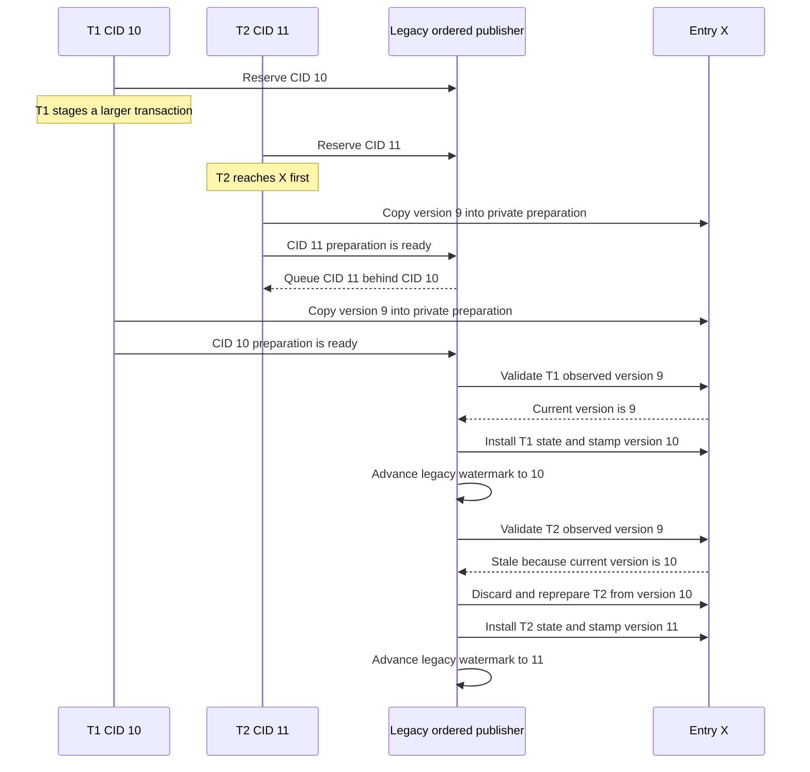

In the legacy design, T2 was allowed to copy X before T1. Correctness therefore
depended on the ordered publisher detecting T2's stale observed version,
discarding its work, and recomputing it after CID 10. The current overlapping
diagram avoids that wasted preparation by parking T2 at footprint intersection.

### Legacy disjoint example: preparation is reusable but installation waits

```mermaid
sequenceDiagram
    participant T1 as T1 CID 10
    participant T2 as T2 CID 11
    participant P as Legacy ordered publisher
    participant A as Entry A
    participant Z as Entry Z
    T1->>P: Reserve CID 10
    T2->>P: Reserve CID 11
    Note over T2,Z: T2 reaches independent entry Z first
    T2->>Z: Copy version 9 into private preparation
    T2->>P: CID 11 preparation is ready
    P-->>T2: Queue CID 11 behind CID 10
    T1->>A: Copy version 9 into private preparation
    T1->>P: CID 10 preparation is ready
    P->>A: Validate and install A at version 10
    P->>P: Advance legacy watermark to 10
    P->>Z: Validate T2 observed version 9
    Z-->>P: Still version 9 because A and Z are disjoint
    P->>Z: Reuse preparation and install Z at version 11
    P->>P: Advance legacy watermark to 11
```

Here T2's private preparation was not stale, but the legacy publisher still
delayed its physical installation until CID 10. The current disjoint protocol
removes that unnecessary dependency: T2 may install Z early, while the small
completion/history drain alone remains CID ordered.
